# 設計プロジェクト　手順書

- [設計プロジェクト　手順書](#設計プロジェクト手順書)
- [まず初めに](#まず初めに)
- [松崎研の設備などのお話](#松崎研の設備などのお話)
- [ビニールハウスについて](#ビニールハウスについて)
- [旧陶器研部室について](#旧陶器研部室について)
- [概要](#概要)
- [プロジェクトの背景](#プロジェクトの背景)
- [ハードウェア](#ハードウェア)
- [機能要件](#機能要件)
- [ＶＳＣについて](#ｖｓｃについて)
  - [ＶＳＣのインストール](#ｖｓｃのインストール)
  - [VSC日本語化パッチ](#vsc日本語化パッチ)
  - [自動保存の設定](#自動保存の設定)
  - [Pythonのインストール(必須)](#pythonのインストール必須)
  - [リモートエクスプローラーのインストール(必須)](#リモートエクスプローラーのインストール必須)
  - [Pythonを使う上で便利な拡張機能やプラグイン](#pythonを使う上で便利な拡張機能やプラグイン)
    - [Indent-rainbow](#indent-rainbow)
    - [Evillinspector](#evillinspector)
    - [Print](#print)
- [Raspberry Piのセッティング](#raspberry-piのセッティング)
  - [Raspberry Pi imagerのダウンロードとOSインストール](#raspberry-pi-imagerのダウンロードとosインストール)
  - [実機へ挿入](#実機へ挿入)
  - [初回セッティング](#初回セッティング)
- [SSH接続](#ssh接続)
  - [ＳＳＨ接続先の設定(VSC)](#ｓｓｈ接続先の設定vsc)
- [ＳＳＨエラーハンドリング](#ｓｓｈエラーハンドリング)
  - [うまくいかないときは？](#うまくいかないときは)
- [Raspberry Piにおいて便利な機能集](#raspberry-piにおいて便利な機能集)
  - [よく使うコマンド集](#よく使うコマンド集)
- [MariaDBのセッティング](#mariadbのセッティング)
  - [MariaDBのインストール](#mariadbのインストール)
  - [MariaDBの初回設定](#mariadbの初回設定)
  - [ユーザー作成](#ユーザー作成)
- [プログラミング](#プログラミング)
  - [プログラムひな形](#プログラムひな形)
  - [もっと単純化したひな形(python初級者用)](#もっと単純化したひな形python初級者用)
- [Slack通知](#slack通知)
  - [センサ値取得](#センサ値取得)
- [pythonプログラミングにおいて便利なテクニック(未)](#pythonプログラミングにおいて便利なテクニック未)
- [工程表](#工程表)
- [作業記録](#作業記録)

# まず初めに

今回のプロジェクトではRaspberry Pi ３B+を２機使用しました。
プロジェクトで使用したRaspberry Piでの操作や屋外、屋内での作業をここに記します。

# 松崎研の設備などのお話

2023 10/31現在、松崎研３年の研究室では有線接続が基本となっています。
Raspberry Piに全学Wi-Fiの固定IPを割り振ってもらっていない場合、Wi-Fi経由での通信はできません。
研究室外にRaspberry Piを設置する場合は白土先生に固定IPの割り振りをお願いする必要があります。
後述のSSH接続も、同じ有線ネットワーク内での接続を前提としています。
電源タップと有線のLANケーブルの数が少ないですが工夫して接続してください。
先生に言えば電源タップ増設用の機材は貸し出してもらえると思います。

# ビニールハウスについて

水栓は開けたら必ず閉めてください。
定期的な草刈りは必須です。
たまに蛇がいます、マムシのようです(重要)
虫刺されと蛇などの被害防止に長靴と長袖を着用しましょう。

# 旧陶器研部室について

松崎研の物置です
一番奥にある電気の繋がれた棚みたいなものは育苗機です。
手が回っていないので使えそうなら手を加えてみてください。
アイデアとしては、電源と棚の間に１００V２５AのSSR(ソリッドステートリレー)を噛ませてラズパイで制御して、日照時間を管理などなど。

# 概要

プロジェクトの目的
ビニールハウス内の水循環タンクの水位が減った際の補充タイミングのslack通知
ビニールハウス内の環境のモニタリング

# プロジェクトの背景

2023 10/27現在、2つのタンクに水を手動で補充している。
4日ほどに１回ビニールハウスへ歩いていき、水が減っているか人の目で確認してから補充している。
減っていないときもあり、その際は徒労に終わる。
また、ビニールハウス内の環境をモニタリングする機材が現在存在せず、ハウス内がどのような環境になっているのか現地に赴かないとわからない。

# ハードウェア

Raspberry Pi3B+２機(測定用、データベース用)
フロートスイッチ
環境センサ(オムロン ２JCIE-BL01)

# 機能要件

水位が一定以下になるとslackにアラートメッセージ送信
環境センサ測定値を１ｈおきにＤＢへ放り込んで外部ネットワークから見える化

# ＶＳＣについて

私はＶＳＣを使ってＳＳＨを利用してラズパイにアクセスし、プログラムを編集していました。
ここにはＶＳＣのインストー方法、ＳＳＨでの接続方法を記します。
また、入れていると便利な拡張機能・プラグインも記しておきます。

## ＶＳＣのインストール

<https://code.visualstudio.com/download> にアクセスします。

Windowsを選択します。自動的にダウンロードされます。
インストールします(先生の権限が必要になると思います)

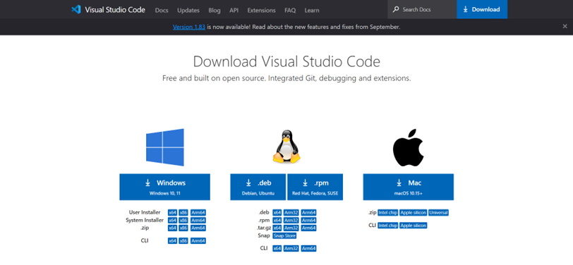

Windowsを選択します。自動的にダウンロードされます。
インストールします(先生の権限が必要になると思います)

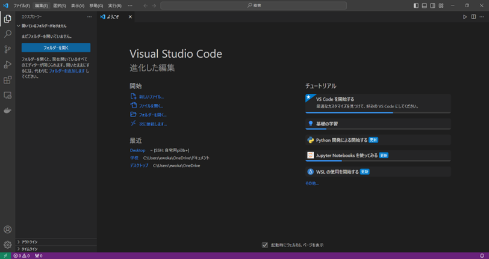

## VSC日本語化パッチ

VSCを日本語表示にできます。

extensionsの検索欄にjapaneseと検索し、上記の拡張機能をインストールします。

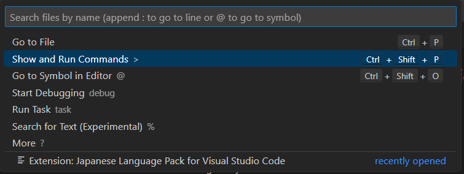

画面上部の検索欄から、Show and Run Commandsを選択します。

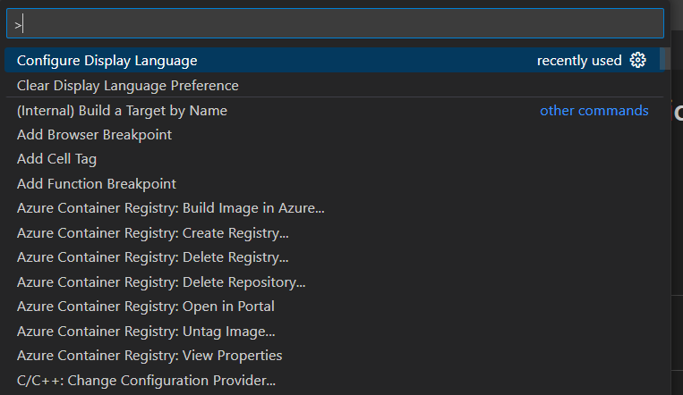

Configure Display Languageを選択します。

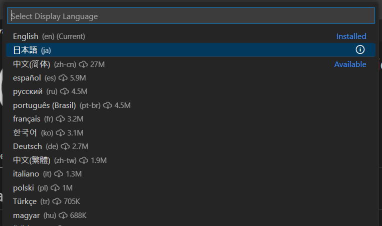

日本語を選択します。

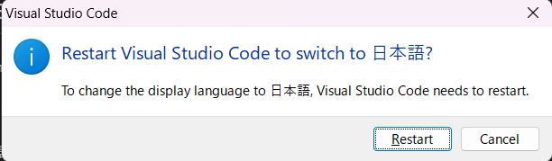

Restartを押下します

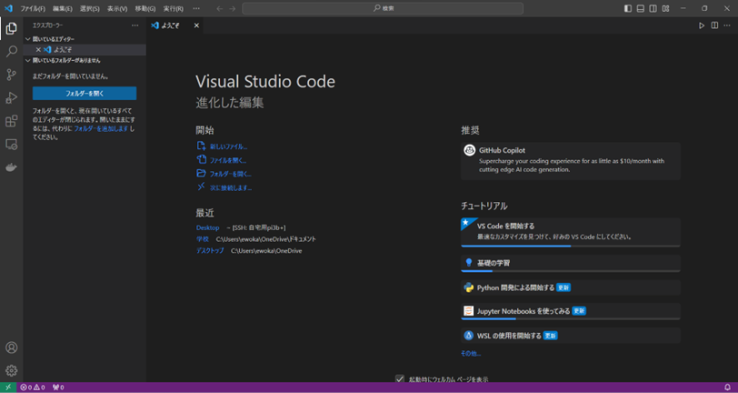

日本語になりました。

## 自動保存の設定

ファイルから自動保存をオンにしておきます。

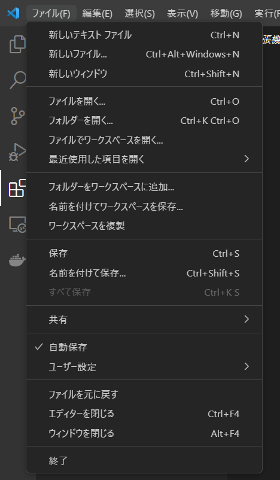

## Pythonのインストール(必須)

画面一番左のメニューバーからextensionsを開きます(四角が四つのアイコン)
検索欄にpythonと入力し、画像の拡張機能をインストールします。
Planceも付随してインストールされますが問題はありません。

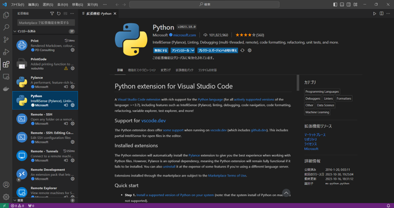

## リモートエクスプローラーのインストール(必須)

検索欄にRemote Developmentと入力し、画像の拡張機能をインストールします。
付随して何種類かの拡張機能がインストールされますが問題はありません。

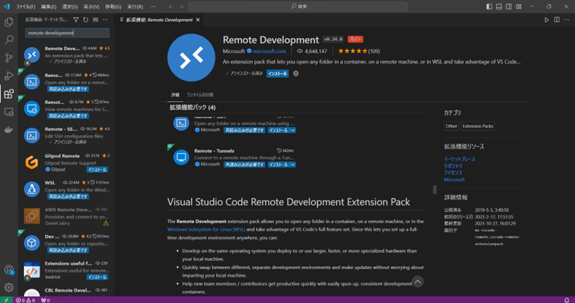

## Pythonを使う上で便利な拡張機能やプラグイン

私が普段使っている便利な拡張機能を紹介します。

### Indent-rainbow

Pythonを書く上で、インデントは重要な要素になります。
綺麗にそろっているか視覚的に確認できる優れものです。

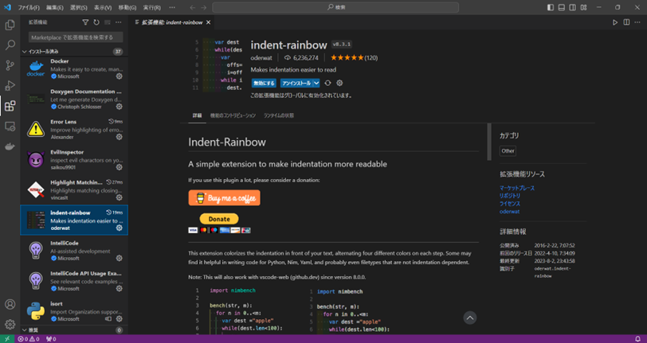

### Evillinspector

プログラムを書く上で全角スペースは悪です。
全角スペースを検出して視覚的に教えてくれます。
本当に便利です。

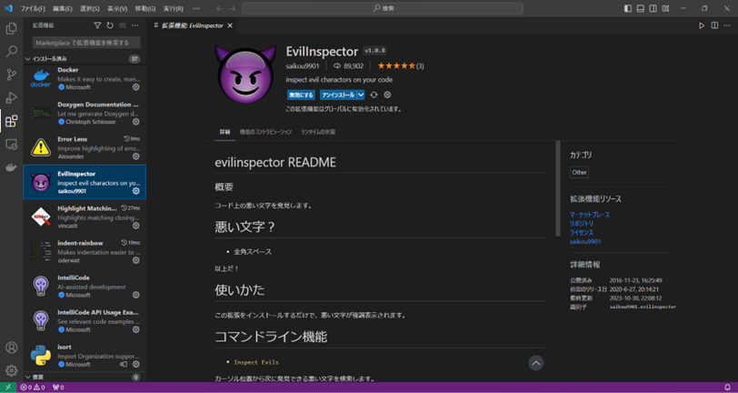

### Print

以前はPrintCodeという名前の個人制作の拡張機能でした。
公式に機能追加され、printという名前で提供されています。

* 使い方

プログラムを編集し終わったら、編集したプログラムを表示した状態で画面右上の印刷マークをクリックします。

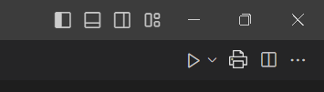

コードを印刷することができます。
結構便利です。

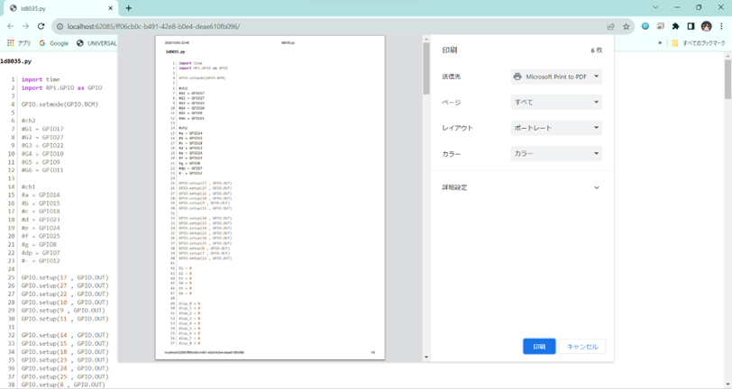

# Raspberry Piのセッティング

自身のPCもしくは研究室のPCで行います。
めちゃくちゃ時間がかかるので授業の最初にやるように。

## Raspberry Pi imagerのダウンロードとOSインストール

<https://www.raspberrypi.com/software/> にアクセスする。

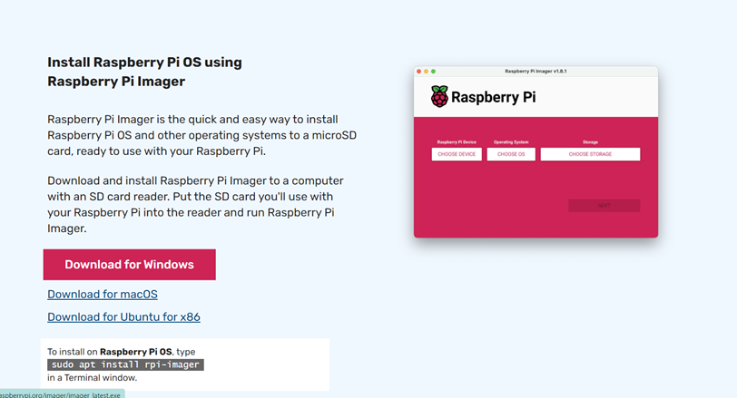

Download for Windowsからimagerをダウンロード＆インストール
(インストールの過程で管理者権限が必要になるので先生にお願いしてください)

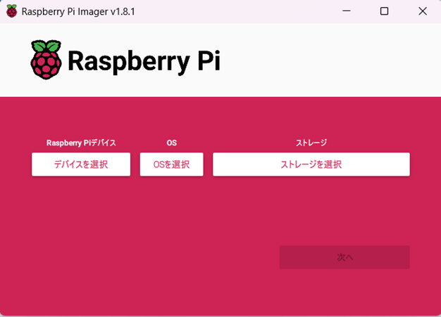

Imagerの起動画面です。
デバイスを選択の項目は

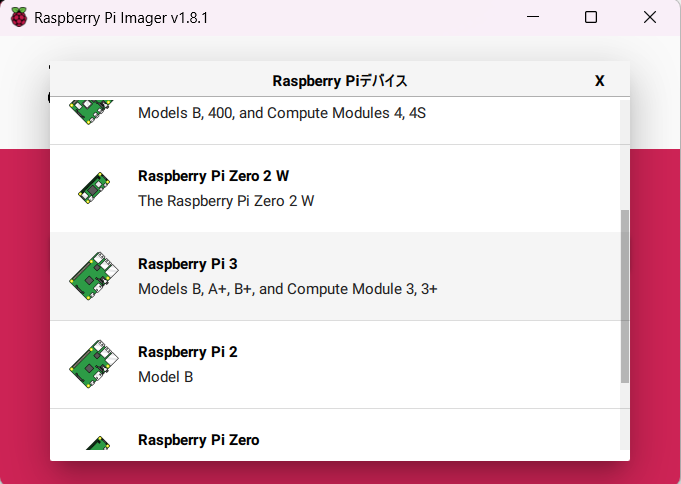

Raspberry PI 3を選択します。

OSは

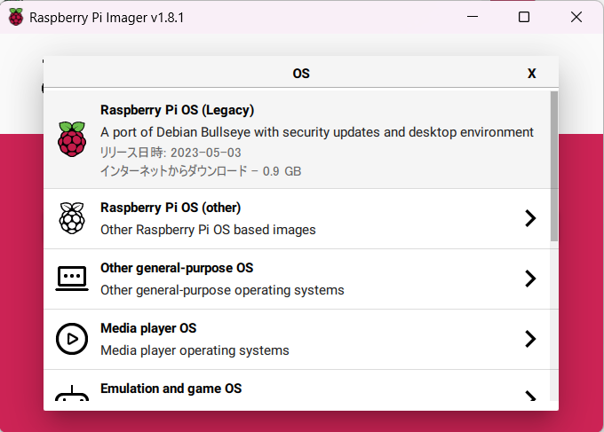

Legacyで大丈夫です。

ストレージを選択(容量でSDカードを判断してください)

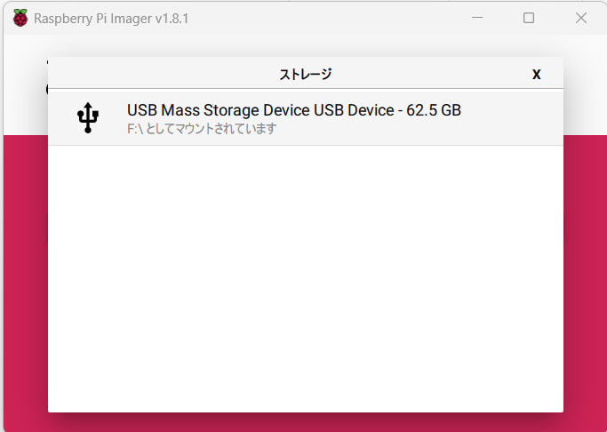

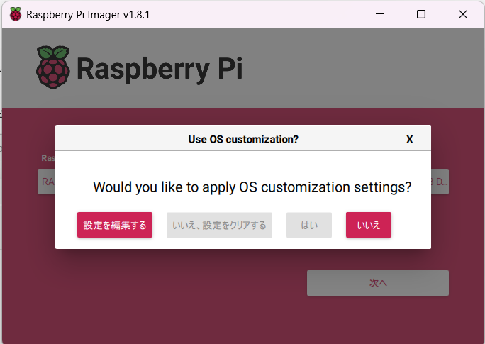

“設定を編集“を選択。

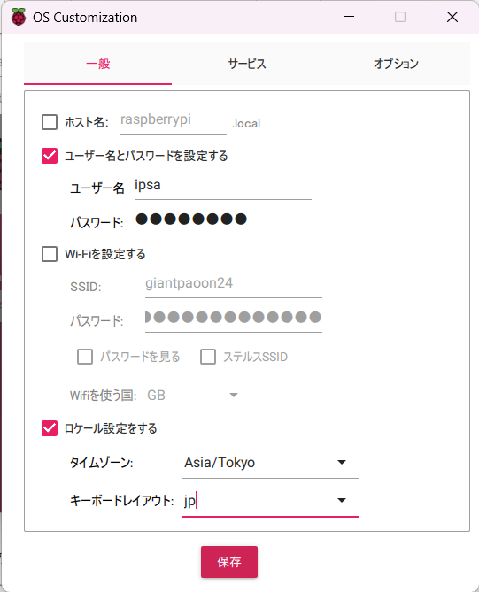

ユーザー名とパスワード、ロケール設定を編集します。
ユーザー名はipsa
パスワードはipsa2221
タイムゾーンはAsia/Tokyo
キーボードレイアウトはjp(usキーボードの場合はus)
に設定します。(ユーザー名とパスワードは先生の指示に合わせて適宜変更してください)

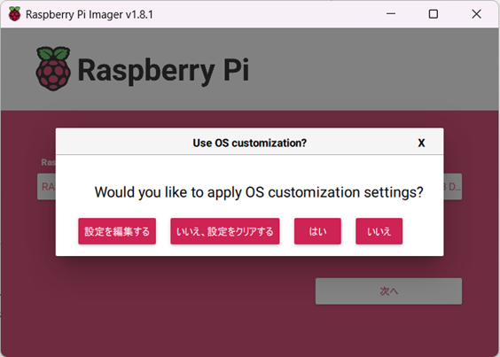

サービスの欄でSSHを有効化しておきます。

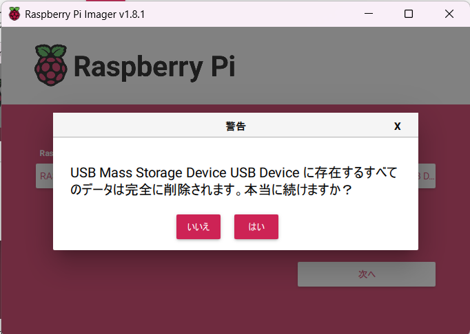

“いいえ“を押下します。

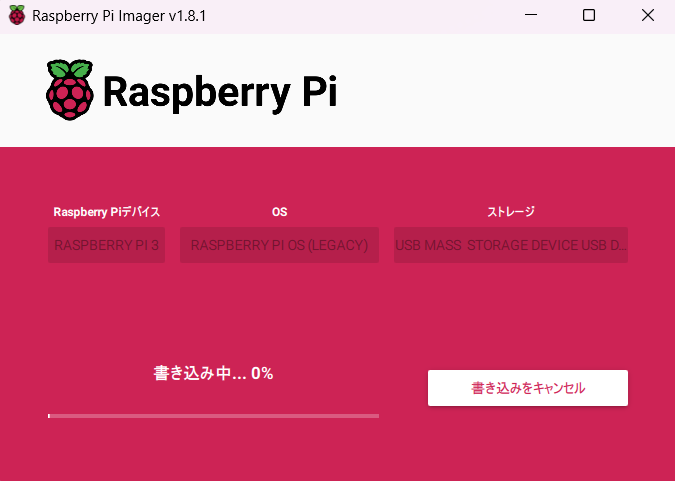

“はい”を押下します。

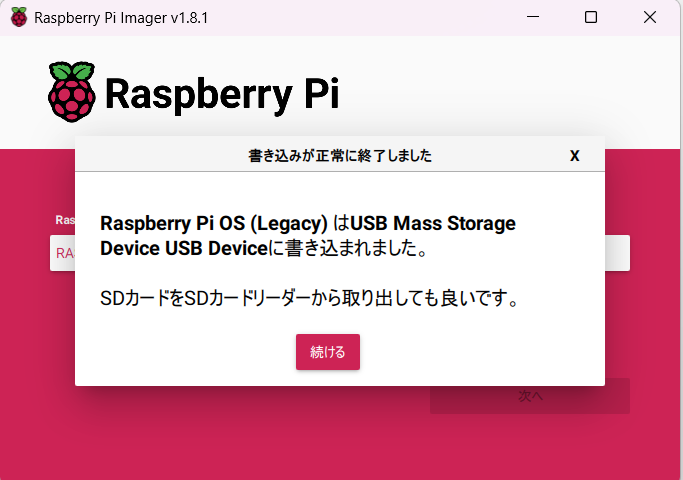

完了するまで待機します。

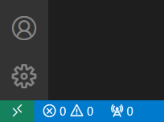

SDカードリーダーから取り出します。

## 実機へ挿入

ラズパイの基盤の裏にあるスロットに挿入します

## 初回セッティング

セッティングは用途にもよりますが、開発しやすいようにssh接続を使うのがややこしくなく一番簡単かな、と思います。
手順を以降に示します。

# SSH接続

SSHでVSCとラズパイを接続し、ラズパイに保存されたプログラムを編集します。

## ＳＳＨ接続先の設定(VSC)

画面左下の＞＜マークをクリックします。

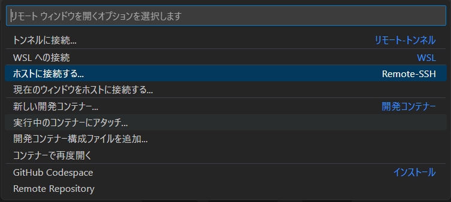

画面上部の検索欄が開くので、“ホストに接続する“を選択します。

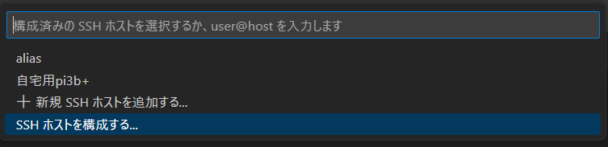

“SSHホストを構成する“を選択します。

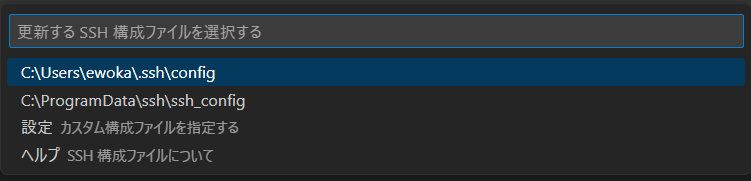

フォルダを選択します。一番上に出てきたもので大丈夫だと思います。

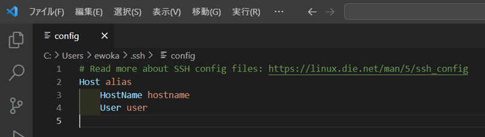

このような画面が出てきます。

以下のように設定します。(画像は私の私物のラズパイへの接続です、IPアドレスは一部隠しています)
Host:識別用の名前を入力します。
Hostname:接続先のラズパイのIPアドレスを入力します。
User:接続先のラズパイのユーザー名を入力します。

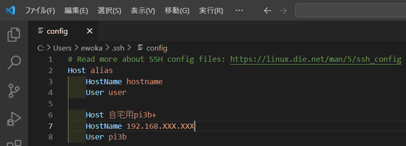

Ctrl+Sで保存します。

# ＳＳＨエラーハンドリング

## うまくいかないときは？

* 初回は何回か失敗することがあります。3-4回は再接続をしてください。  
パスワード入力を求められたらラズパイとの通信まではうまくいっています。  
* ラズパイ側でsshが有効化されているか再確認  
`＄sudo raspi-config` の`interfacing options`からsshを有効化してください。  
* 同一のネットワークにラズパイと自分のＰＣが接続されているか確認  
同一ネットワークでないと接続できません。  
`192.168.210.XXX`の前半3セグメント(XXX以外)が一致しているか確認してください。  
* SSHキャッシュが残ってしまっている場合  
`C¥ユーザ￥.ssh\known_hosts`の中身をすべて削除してやり直してください
* configの情報が正しいか確認
間違った情報を入れていると接続できません。  
特にターミナルの`hoge@raspberrypi:~$`のhogeの部分がVSCのSSH構成ファイルにおけるUserに該当する情報です。たまに間違うので確認を。

* どうしようもないときはwindowsのcmdから`ipconfig`、`ping 192.168.210.XXX`などを試して接続状況を確認してください。

* おまけ
使用するかはわかりませんが、2023 10/27/2023現在、ラズパイZEROではSSH接続できませんでした。  
私はZEROを使うときはWinSCPとTera Termを使っていました。  
どちらも便利なのでぜひ使ってみてください。  

# Raspberry Piにおいて便利な機能集

よく使うものを集めました。困ったら見てください。

## よく使うコマンド集

* ls(エルエス)：リストの略。自身が存在するファイル内のフォルダやファイルを一覧で確認できる。これは本当によく使うので覚えてください。  
ちなみに、フォルダやファイル名は途中まで打ってTabキーを押すと勝手に補完されます、タイポの防止や打つ手間が省けて便利。  
* cd：フォルダ移動の時に使う。(“~$:cd Desktop”のような使い方)
* ../：1つ上の階層に戻る。ルートディレクトリに戻りたかったらこれを１回打って上キーとエンターを連打したら戻れる。
* exit：コマンドラインやMariaDBなど様々なところから脱出できる。後述のnanoでは使えないので注意。
* mkdir：ディレクトリを作成します。半角開けてフォルダ名を入力してください。
* touch：ファイルを作成します。半角開けてファイル名を入力してください。

* 文書やプログラムファイルをラズパイで開いて編集したい
  * ~$:nano ファイル名でファイルを開く。
  * Ctrl+Sで保存
  * Ctrl+Xで退出
  * 簡単なプログラム修正なんかはここでやったほうが早い。

* ファイルの書き込み権限がないと言われたら
  * nanoなどで構成ファイルを編集しようとしていると、書き込み権限がないといわれて編集できないことがあります。  
  その場合は編集したいファイルが存在するフォルダへcdで移動して、  
  `$ ls -l`  
  とコマンドを打ち込みます。  
  すると、  
  `drwxr-xr-x フォルダ名など`  
  と表示されると思います。(小文字はファイルの設定により適宜変わります)  
  ｒは読み取り権  
  ｗは書き込み権  
  ｘは実行権  
  です。  
  `drwxr-xr-x`の場合はユーザーに書き込み権限がありません(詳しくは調べてください)

    一番簡単な方法は、  
    `$ sudo nano ファイル名`  
    でnanoを開いて編集する方法です  

    しかし、この方法だとファイルを開くたびにスーパーユーザーを指定しなければならず、ファイルを開けないなどの不都合が発生する状況が発生します。  
    構成ファイルの設定を恒久的に変更する場合はこの方法で構いません。  

    よく編集するファイルの場合は以下のように設定します。  
    `$ chmod o+w ファイル名`  
    と打ち込みエンターを押下します。  
    `$ ls -l`  
    で権限を確認します。  
    `drwxr-xr-x-`が、`drwxr-xrwx`などに変更できていれば成功です。  
    (ｗがなかったところにｗが追加されていれば成功)  

    全権限を付与したい場合は親フォルダに777を付与するといいです。オープンにする場合は推奨されませんが…  
    `$ sudo chmod 777 フォルダ名`　で全権限が付与できます。Lsで確認してフォルダ名の色が変わっていたら成功です。不安な場合は$ ls -lで権限を確認しておきましょう。

    多くの場合、重要なファイルやフォルダの権限が制限されていることが多いので、権限の変更には十分注意しましょう。  
    どのファイルを変更したかメモしておくのも手です。  

# MariaDBのセッティング

コマンドラインとラズパイの仕様に慣れていないと相当きついです。  
この黒い画面に慣れましょう。  
慣れたらマウスが煩わしくなります。  
文字だけのインターフェースをＣＵＩといいます。  
逆に普段見ているのはＧＵＩです。  

## MariaDBのインストール

ラズパイのLXTerminalを開きます。

`$ sudo apt update`  
ラズパイを最新の状態にします。

`$ sudo apt install mariadb-server -y`
と入力します。  
MariaDBがインストールされます

`$ sudo mariadb-secure-installation`  
Enter current password for root でMariaDB内のrootのパスワードを求められるので決めて入力します。(メモ必須)

ここからは色々尋ねられるのでY/Nで選びます

switch to unix_socket authentication <<n

change the root password? <<y  
MariaDBで使用するパスワードを入力します。(２回)

Remove anonymous users? <<y

Disallow root login remotely? <<n

Remove test database and access to it? <<y

Reload privilege tables now? <<y

## MariaDBの初回設定

ローカルからのアクセスを指定する行をコメントアウトします。  
`$ sudo nano /etc/mysql/mariadb.conf.d/50-server.cnf`  

`bind-adress = 127.0.0.1`  
の行を  
`#bind-adress = 127.0.0.1`  
に変更します。(コメントアウト)

nanoの使い方がわからない場合は調べるか、この資料の
「文書やプログラムをラズパイで開いて編集したい」
の項を読んでください。

`$ mysql -u root -p`  
Enter password:先ほど設定したパスワードを入力

MariaDB[(none)]>　の表示になります

以下のように入力します  
`MariaDB[(none)]>　grant all privileges on *.* to root@”%” identified by “先ほど設定したパスワード” with grant option;`

`Quely OK , 0 rows affected (0.000sec)`などと表示されれば成功です。

`exit`でMariaDBから退出し、mysqlを再起動して完了させます。  
`$ sudo systemctl restart mysql`

## ユーザー作成

MariaDBにrootでログインします。  
`$ mysql -u root -p`  
enter password: 入力  

ルートユーザーであることを確認します。  
MariaDB[(none)]> SELECT USER();  
+------------------+  
|user()  
+------------------+  
|root@localhost  
+------------------+  
と表示されます。  

`MariaDB[(none)]> USE mysql;`  
`MariaDB[(mysql)]>`　に変化します。

`MariaDB[(mysql)]> SELECT Host,User,Password,plugin FROM user;`  
ユーザーとその情報一覧が閲覧できます。 

`exit`で一回抜けます。

`$ mysql -u root -p`  
`MariaDB[(none)]>CREATE USER ‘ipsa’@’%’ IDENTIFIED BY ‘ipsa2221’;`  
Ipsaは研究室で決められたユーザー名、ipsa2221も研究室で決められたパスワードに置き換えてください。  
色々触るので全権限を付与します。(本当は厳密に管理したほうが良い)  
`MariaDB[(none)]> GRANT ALL PRIVILAGES CREATE ON *.* to ‘ipsa’@’%’;`  

`exit`で一回抜け、  
`$ mysql -u ipsa -p`  
Enter password:入力  
でログインしてみます。

`SELECT USER();`  
で、自分のアカウントが表示されていれば成功です。

データベースとテーブルの作成  
先ほど作成したipsaアカウントでログインします。

データベースを作成します。  
`MariaDB[(none)]> CREATE DATABASE 23project;`  
と入力します。

データベースが作成されました。  
`MariaDB[(none)]> SHOW DATABASES;`  
で確認しましょう。

あとは自身の用途に合わせて操作してください。  

権限がないよーパーミッションデナイって出る！  
権限が正しく付与されているか確認しましょう。  
Rootでログインし、  
`MariaDB[(none)]> SHOW GRANTS FOR ipsa;`  
で権限を確認します。  
`GRANT ALL PRIVILAGES ON *.* TO ‘ipsa’@’%’ IDENTIFIED BY PASSWORD ‘難解な文字列’`  
以外であれば制限されています。

# プログラミング

ここからは実務プログラミングを始めました。  
今回は機能ごとに異なる.pyファイルを作成し、後ほど合体させる方法をとりました。  
正直、プログラムは書いた量がモノを言うと思うのでたくさん書いてください。  
授業でやったみたいに最初から全部書くのではなくて、機能ごとに書いていって後で合体させて組み立てる方法がやりやすいと思います。  
ifやwhile、tryなどの構文はネットに転がっているpython講座みたいなものを参照してください。  
あと、ネットのブログなどに載っているプログラムをコピペする際は引用元リンクなどを必ずコメントで残しておいてください。あとで困ります。  

## プログラムひな形

自分で使うときに便利だと思って作っていたものをここに共有します。
頑張ってプログラムしてください。
わからないところは書き加えるので質問してくれ。
***
***引数や処理、if文などは必ずコメントアウトでしつこいくらい説明を残すこと。
(～するときは　～する　しない時は　～する/しない、など)  
初めて見た人が理解できるようなコメントを書くこと。  
何らかの形で出力する引数は必ず初期化して上部に記載すること、でないと後から見返したときにわからなくなる。  のちにデータ抽出する際に手間が何倍にもなる。  
わからないことやエラー文は調べる癖をつける、必ず自身の学びになる***
***
1.	_*_ coding : utf-8 _*_ ＃おまじないの一種、絶対書いて  
2.  
3. Jikan = 0
4. LCD_status = 0 #引数やカラムの設定と初期化 値はモノによるがintの初期値はゼロ  
5. #DBなどと接続する際に必ず必要となるので、最終的な出力値の引数は必ずここに書くこと
6.	 
7.	Inport time
8.	Inport numpy as numP #必要モジュールのインポート
9.	Inport GPIO ＃既定の名前が長いときは８行目のような形でニックネームを付けられる
10.	 
11.	＃初期設定
12.	#GPIO セッティング
13.	GPIO.setwarnings(False)
14.	GPIO.setmode(GPIO.BCM)
15.	 
16.	＃ドライバ設定
17.	hogehoge
18.	など
19.	 
20.	#使う GPIO 決める
21.	LED_GPIO = 18
22.	pump_GPIO = 24
23.	GPIO.setup(LED_GPIO , GPIO.OUT)
24.	GPIO.setup(pump_GPIO , GPIO.OUT)
25.	 
26.	 
27.	＃ここから実務
28.	try:
29.	    
30.	    
31. 実務、ここにゴリゴリプログラムを書く
32.	    
33.	
34.	except Exception:
35.	print("----- Error! -----")
36.	pass
37.	finally: ＃デーモンプログラムの場合ここには基本来ない
38.	クリーンナップ# #これがないとエラー出る
39.	GPIO.cleanup()

## もっと単純化したひな形(python初級者用)

importとかGPIOとかわからんって人はここからやってみてください。  
一番左は行番号です。緑の文はコメントアウトされた文です、実行に関与しません。  
インデント(行最初の空白)はきれいに合わせるようにしてください。でないと動作しません。  
授業でやったArduino IDEでのloopの中身の書き方と考え方は同じです。  
最初はエラー文を表示させずに、printを表示するところから始めましょう。

***

1. _*_ coding : utf-8 _*_ #文字化けを防ぐおまじないです。
2. while True: #true文の意味は授業で習ったよね？
3. try: #exeptと対になるもの
4. 実務、ここにゴリゴリプログラムを書く。
5. Cのwhileと同じで、中身が１(もしくはTrue)になるように書く。
6. except Exception: #tryと対になるもの。上記のプログラムがエラー吐いたらここに回してくれる。
7. print("----- Error! -----")
8. pass
9.  

# Slack通知

今回のプログラムの機能要件は「フロートスイッチがオンになったらslackに通知を送る」です。  
詳しいプログラムの内容を見ていきましょう。  

***

最初に回路を組みます。  
タクトスイッチを用意し、３Vとタクトスイッチ、GPIOを接続します。  
GPIOの番号はプログラムにメモしておいてください。  

回路ができたらプログラムを書いていきます。  

単純化したテンプレートを使用します。  

GPIOを使うのでRPi.GPIO as GPIO、slackを使うのでslackweb、あとはsys、time辺りをimportしておきます。(おまじないの直下)  
GPIO.setmode(GPIO.BCM)でGPIOのセットアップをします。  
SW_GPIO =番号 でスイッチと繋いだGPIOの番号を指定します。  
GPIO.setup(SW_GPIO , GPIO.IN , pull_up_down = GPIO.PUD_DOWN)でGPIOを入力モードにします。  
slackという引数を用意し、slack = slackweb.Slack(url = “リンク”)と記述します。  
Whileの外にフロートスイッチ用の引数を用意します。名前はLast_Status辺りで設定します。  
Last_statusはスイッチの初期値です。０の時は水がある状態、１になると水がない状態です。  
ブーリアンで調べてもらえばわかると思いますが、０はFalse、１はTrueと関連しています。  
今回のスイッチの初期値は０なのでFalseを指定します。  
tryの中に移動します。  
switch_status = GPIO.input(SW_GPIO)でGPIOの情報と連動させます。  
switch_ststus =１ になった時にslackに通知を送りたいので、if文を使って記述します。  
条件式を書く場合は === と == と = 、 !=それぞれの違いを頭に入れておきましょう。  
初期値０とスイッチの値が異なったときに通知を送りたいので、それぞれの引数を使って条件式を書きます。  
ifの中身は、動作したことがわかりやすいようにprint(switch_status)でステータス表示させます。  
ここまで来たらifの中にifを入れてネストさせます  
if内のifの中身は、スイッチが動作した時の状態を記述します。  
つまり、slackのAPIを呼び出して動作させます。  
slack.notify(text = “送信したい内容”)と記述します。  
ログで送信されたかどうか確認したいので、print()で実行画面にログを吐かせます。  
time.sleep()で連続稼働を制限します。
一個目のifの中に移動し、スイッチのステータスをLast_statusに反映させます。
except Exception:はexept KeyboardInterrupt:に変更します。
exept KeyboardInterrupt:の中身は、GPIO.cleanup()とsys.exit()と記述します。
これにより、実行画面でCtrl＋Cを押下することにより暴走したプログラムを停止させられるようになります。

ここまで書けたらスイッチを押して試してみましょう。
エラーが出たら文を読むのを忘れずに！

## センサ値取得

MariaDBのテーブルへ値を送信
合体

ここらへんは後でgithubに上げておきますので参考にしてください  
井上のgithubページ  
上げたら更新履歴をここに記入しておきます

# pythonプログラミングにおいて便利なテクニック(未)

私がよく使うテクニックをまとめておきます。
随時更新。

# 工程表

６週目：今後の方針相談、工程決め、パーツ選定  
7週目：井上、平井→MariaDB用ラズパイ設定  
８週目：井上、平井→測定用ラズパイ設定  
９週目：井上→プログラム作成(センサ値取得スクリプト)  
平井→プログラム作成(フロートスイッチ値によるslack通知スクリプト)  
10週目：井上→プログラム作成(センサ値取得スクリプト)  
平井→プログラム作成(フロートスイッチ値によるslack通知スクリプト)  
１１週目：井上→プログラム作成(MariaDB接続スクリプト)  
平井→プログラム作成(フロートスイッチ値によるslack通知スクリプト)  
１２週目：井上→プログラム作成(MariaDB接続スクリプト)  
平井→プログラム作成(フロートスイッチ値によるslack通知スクリプト)  
１３週目：井上→プログラム作成(MariaDB操作スクリプト)  
平井→プログラム作成(フロートスイッチ値によるslack通知スクリプト)  
１４週目：井上、平井→結合テスト  
１５週目：井上→実地テスト  
１６週目：発表  

# 作業記録

テーマが決まった10月からの分を記録しておきます。

10/5
現場確認　手動で水を補充、ビニールハウスにヘビ(マムシ？)の存在を確認  
Raspberry Pi 3B+ のOSインストール

10/10  
測定用3B+(IPSA353)  
userID : ipsa  
pass : ipsa2221  
address : 192.168.210.156  

10/17  
Slackに通知するプロトタイププログラムの作成→完成

10/19  
ビニールハウス外の草刈り  
菜の花の種まき  
空心菜の収穫  
百葉箱(仮)の寸法測定  
空心菜カマキリ発見  

10/24  
今後の方針相談  
工程表  

10/26  
MariaDB機(IPSA303)のセットアップ  
userID : ipsa2221  
pass : ipsa2221  
Address : 192.168.210.163  
MariaDBのユーザ：ipsa  
MariaDBのパスワード：ipsa2221  
データベース名：23project  
テーブル(未作成)：datetime , pressure(FLOAT) , humidity(FLOAT) , pressure(FLOAT) , UV(FLOAT) , 照度(FLOAT) , PRIMARYKEY

10/31  
測定用ラズパイのセットアップ(ホスト名が違った)  
プログラミング環境設定(VSC)  
SSH接続  

11/2  
平井：slack通知プログラム作成  
井上：センサ値所得プログラム作成
